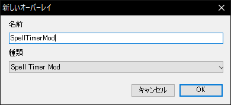

# ACT_OverlayPluginSpellTimerMod

### OverlayPlugin 付属の SpellTimer を改良した OverlayPlugin 用Addon

### インストール方法

1. addons、ja-JP、resources フォルダを OverlayPlugin フォルダに上書き
1. OverlayPlugin 設定画面で新しいオーバーレイを追加
1. 種類 Spell Timer Mod を選択

### ライセンス :

[The MIT License (MIT)](LICENSE)
